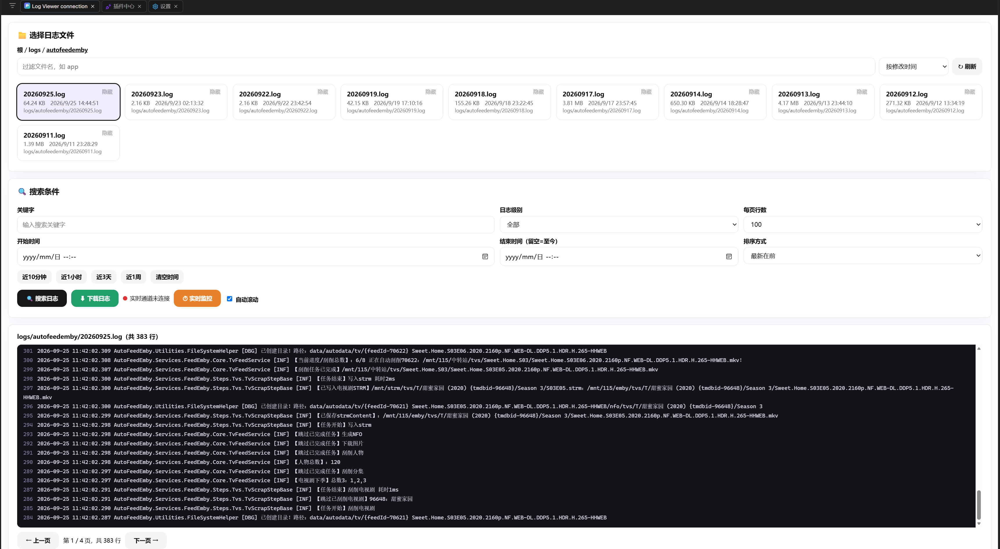

# 日志查看器 Log Viewer

[](https://github.com/yxlongery/dbx-logviewer/releases)
[](LICENSE)


> 在 DBX 服务器上直接看 `.log` 日志：滚动查询、模糊搜索、实时监控、分块下载，开箱即用。



## ✨ 功能特性

- 📁 **目录浏览**：面包屑下钻子目录，文件名过滤 + 排序（时间/名称/大小），点文件即查；只读展示 `.log` / `.out`（`logs/browse`）
- 🙈 **隐藏**：仅在界面隐藏、文件保留，按连接记住名单，可一键恢复；无真删操作
- 🔍 **搜索**：关键字模糊 ＋ 级别（ALL / ERROR / WARN / INFO / DEBUG / TRACE）＋ 时间范围（含近10分钟/1小时/3天/1周快捷）＋ 分页 ＋ 正序/倒序；搜索条件自动记住，下次打开沿用（`logs/search`）
- ⏱ **实时监控**：从末尾 200 行起播，后台轮询增量经 `logs/append` 事件推送，支持自动滚动，一键启停（`logs/tail` / `logs/stop`）
- ⬇ **下载**：按 2000 行分块拉取、前端拼装后经 fileTransfer 落盘，Web 宿主自动回退 Blob 下载（`logs/downloadChunk`）
- 🛡️ **安全**：日志原文插 DOM 前 HTML 转义；相对路径经 canonicalize 约束在日志目录内（含 `..`/绝对一律拒绝）；隐藏名单只存界面状态

## 🚀 快速上手

1. 在 DBX 插件商店安装本插件（或从 [Releases](https://github.com/yxlongery/dbx-logviewer/releases) 下载 `.dbxp` 手动安装）
2. （可选）分散在别处的日志，先挂进 DBX 容器独立顶层——与 `/app/data` **无嵌套**，顺序随便写：
   ```yaml
   volumes:
     - ./data:/app/data
     - /vol1/1000/docker/autofeedemby/logs:/logs/autofeedemby:ro
   ```
3. 新建「日志查看器连接」，「日志根目录」填多根（逗号分隔，如 `/app/data,/logs`），测试连通
4. 从该连接进入工作台 → 下钻选文件 → 搜索 / 实时监控 / 下载

## 🖥️ 使用说明

### 选择日志文件

- **面包屑下钻**：根下先列各根短名（如 `data`、`logs`），点目录进入，点面包屑回退；换目录时清空选中
- **过滤与排序**：过滤框按文件名子串筛选；可按修改时间（默认，新的在前）/名称/大小排序；刷新只重载当前目录并保持选中
- **隐藏**：卡片右上“隐藏”只在界面藏起（文件保留），名单按连接记住；点“恢复全部”找回；断裂的旧链接也建议直接隐藏

### 搜索条件

- **关键字**：子串模糊匹配，命中处黄色高亮
- **级别**：按 `ERROR/WARN/...` 子串匹配行内容；注意 .NET 系日志用 `[INF]/[DBG]/[WRN]/[ERR]` 缩写，选 `INFO` 搜不到 `[INF]`，此时用关键字搜
- **时间范围**：`datetime-local` 手填，或点快捷按钮**近10分钟 / 近1小时 / 近3天 / 近1周**（自动填开始、结束留空=至今，并直接搜）；“清空时间”恢复全量
- 时间按行内首个 `yyyy-MM-dd HH:mm:ss` 解析（`-`/`/`、`T` 分隔都认）；无时间戳的行在有时间条件时会被跳过
- **每页行数 / 排序**：单页 ≤ 500（默认 100）；最新在前/最早在前；搜索条件（关键字/级别/每页/排序/目录/文件）自动记住，下次打开沿用并自动恢复选中

### 实时监控与下载

- **实时监控**：从末尾 200 行起播，新行自动追加；`自动滚动` 勾上时跟到底；切换文件/隐藏当前文件前先停监控
- **下载**：按当前关键字+级别过滤，分块拉取后经 fileTransfer 落盘（桌面端弹保存框，Web 端走 Blob）；大文件多轮拉取，进度显示在提示行

## ❓ 常见问题

- 看不到某目录：先确认容器内路径存在（`docker exec dbx ls /logs/...`），再确认连接根目录包含它；compose 子路径挂载必须落在独立顶层，勿与 `/app/data` 嵌套
- 时间搜不到：行内时间格式是否 `yyyy-MM-dd HH:mm:ss`；结束留空=至今；跨天日志先“清空时间”确认总量
- 级别搜不到：.NET 日志缩写（`[INF]` 等）与级别选项对不上时改用关键字
- 点旧链接报错：目标挂载已迁移的断裂链，用“隐藏”藏掉即可

## ⚙️ 限制

- 只列出 `.log` / `.out` 文件（隐藏文件/目录不展示）
- 单页 ≤ 500 行（默认 100）；单次搜索最多返回 20000 行，超出截断并提示
- 实时监控初始 200 行；下载分块 2000 行/轮
- 隐藏只影响界面展示，不删除任何文件

## 🧩 目录结构

```text
manifest.json                  插件身份、连接表单、权限与工作台声明
backend/src/main.rs            Rust Sidecar：连接管理 ＋ 日志接口
ui/index.html                  单文件前端，无构建，开箱即用
assets/plugin.svg              插件图标
docs/screenshot.png            工作台截图
.github/workflows/             Release 自动打 5 平台包
```

日志接口：`logs/browse`（目录浏览）· `logs/search`（搜索）· `logs/tail` / `logs/stop`（实时启停）· `logs/downloadChunk`（分块下载）。

## 🛠️ 本地开发

```bash
# 后端构建/测试（SDK 不在 crates.io，用 CLI 自带目录 patch，勿改 Cargo.toml）
cargo build --config 'patch.crates-io.dbx-plugin-sdk.path="<CLI自带sdk-root>/plugins/sdk/rust/dbx-plugin-sdk"'
cargo test --config 'patch.crates-io.dbx-plugin-sdk.path="<CLI自带sdk-root>/plugins/sdk/rust/dbx-plugin-sdk"'

# 前端联调（只绑回环，开发机浏览器打开）
dbx-plugin dev --path . --port 5190

# 打本地验证包（当前平台，Alpine 下为 musl 版）
dbx-plugin package .
```

生产二进制在 NAS 上 `rust:1-bookworm` 容器编 gnu release 版后重组 `.dbxp`。

## 📦 发版

打 Tag → GitHub Release（published 触发 workflow 打 5 平台包）→ 向 `t8y2/dbx-store` 提候选 PR（首发 [#164](https://github.com/t8y2/dbx-store/pull/164)）。版本号在 `manifest.json` 与 `backend/Cargo.toml` 手动同步保持一致。

## 📄 许可证

[Apache-2.0](LICENSE)。

---

## English Summary

**Log Viewer** is a DBX plugin for browsing server `.log` files: directory drill-down (breadcrumb + filter + sort), paged search (keyword + level + time range with quick ranges + sort), live tailing via `logs/append` events, chunked download, plus UI-only hide (never deletes files).

- Install from the DBX store (or a `.dbxp` in [Releases](https://github.com/yxlongery/dbx-logviewer/releases)), create a connection with comma-separated log roots (e.g. `/app/data,/logs`; mount scattered logs as independent top-level volumes like `/logs/autofeedemby:ro`, never nested under `/app/data`), then open the workbench from that connection.
- Limits: lists `.log` / `.out` only; ≤ 500 rows/page (default 100); at most 20000 matched rows per search (truncated with notice); tail starts from the last 200 lines.
- Layout: Rust sidecar (`backend/src/main.rs`) + single-file frontend (`ui/index.html`, no build). Build with `dbx-plugin package .`; releases ship 5-platform binaries via the official reusable workflow.
- License: [Apache-2.0](LICENSE).
